# Engineer Survival Guide

1) Understand company values
  - Review company policy (core values and corporate ethics) and determine if safety is a value. We must hold safety as a value. And when safety is a value - NOT a priority - it supports sustainable ESRM. Values are the compass.
  - Check if the company has a safety culture where:  safety considerations come ahead of any action to complete a task, and safety considerations are the basis for decision making when considering a course of action.
2) Understand your program
  - Determine if the company has a safety and risk management program. Understand your personal responsibilities to meet program requirements. Undertake those responsibilities diligently. People's lives and your company's business may depend on it.
3) When you make decisions, put safety ahead of any other objective
  - Even under stressful circumstances or time constraints, safety takes precedence over: Production, Cost, Schedule, and any other competing objective. 
  - Safety is not an objective that is scored and prioritized against other objectives. When we prioritize safety - "when it takes a backseat” - we expose people, the environment, and the company to increased risk. 
4) Pay attention to failures in safety systems and act
  - You must intervene when there are deviations and variances in the intended engineering controls and/or the administrative controls i.e. bypassed, deactivated, circumvented, etc.
  - You must work to correct these deviations and variances / sub-standard conditions and sub-standard work practice. Accepting these variances means you will be part of the inevitable spiral to disaster, and you don't want to be the author of your own case study.

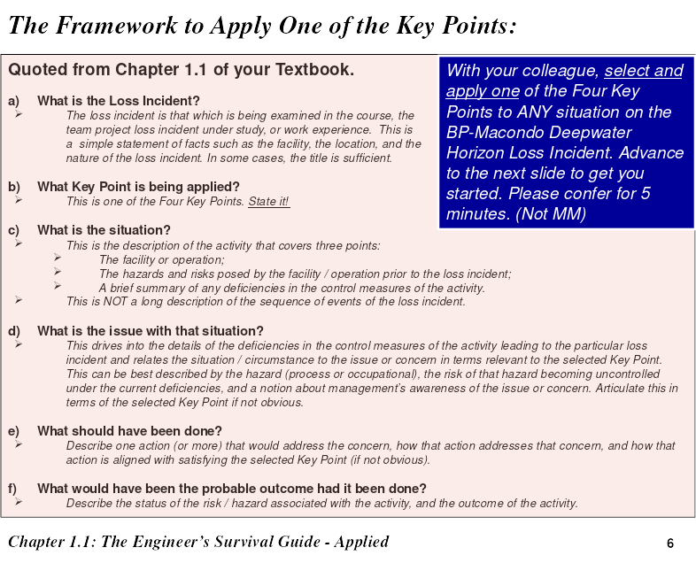
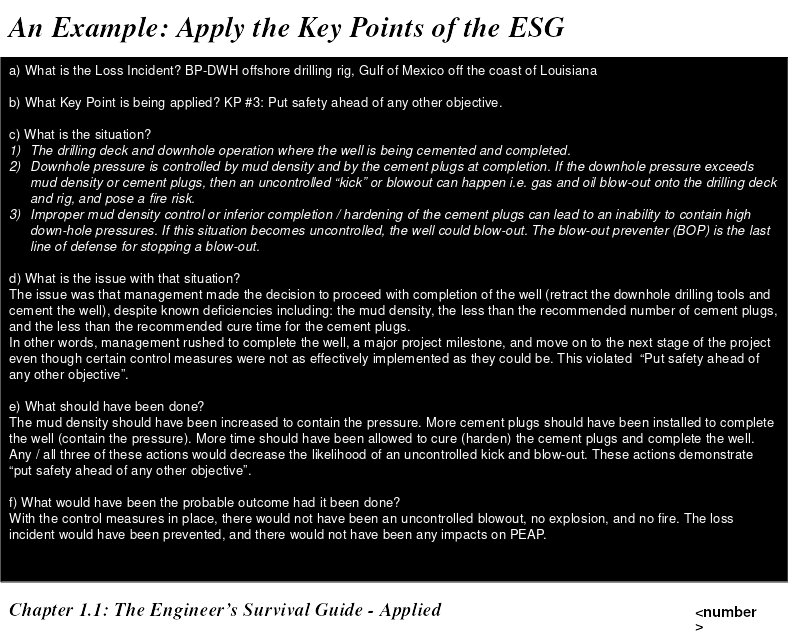

# RME
1) Management Leadership, Commitment and Accountability
2) Risk Assessment and Management of Risks
3) Community Awareness and Emergency Preparedness
4) Management of Change
5) Incident Reporting, Investigation, Analysis and Actions
6) Program Evaluation and Continuous Improvement.
7) Design, Construction and Start-up
8) Operations and Maintenance
9) Employee Competency and Training
10) Contractor Competency and Integration
11) Operations and Facilities Information and Documentation
---
1) Inadequate program
2) Inadequate Program Standards
3) Inadequate compliance with standards

# Analysis of incidents
- what is the incident
- what key point is being applied (One of the 4 above)
- the situation
- the issue with the situation
- what you would have done differently
- possible outcome had you taken the actions you recommended

# How to do case studies
- what was going on?
- issues
- what happened?
- what were the losses?

# PEAP
- People
- Environment
- Assets
- Productivity

# Case Studies


## Loaf of bread

say you're making 10 cents on bread that is sold for 100 cents.
(cost is 90 cents). If you drop a loaf of bread, that's a lot more
bread you need to sell to make up for it


# Models

## Loss incident models
  - energy / line of fire / lack of safeguard
  - energy / line of fire / trigger

## Risk Matrix

```
Consequence ^ M H H
            | L M H
            | L L M
             ------>
            Likelihood
```

## Risk Management Program Umbrella
- Risk Management work process
   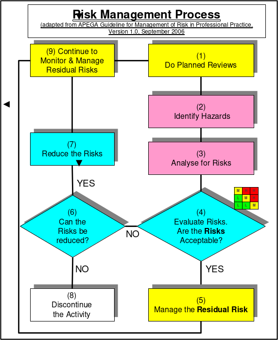 

- Risk Management system
    A framework for leadership to control the residual risks of their 
    organization values
- Administrative Controls and work pracices
- Engineering controls

## Risk Management System
  See the Handbook. It's the thing with 11 elements,
  #1 being Management Leadership, Commitment, and Accountability

- RM work process directs managers to identify risks, determine acceptability,
define and implement control measures to reduce risk to an acceptable level
- RM work process does not explain how to effectively manage and control
  residual risks
- RM system using its elements explains how to manage and control residual
  risks of different activities within the organization

1) Incident happens
2) Investigation
  - collect evidence
3) RCA
4) Corrective actions
  - manage the corrective and preventative actions identified in the RCA
5) Check process effectiveness

1) Find and investigate first
2) Talk to people immediately
3) Deal with parts
4) Deal with paperwork

## Incident Pyramid

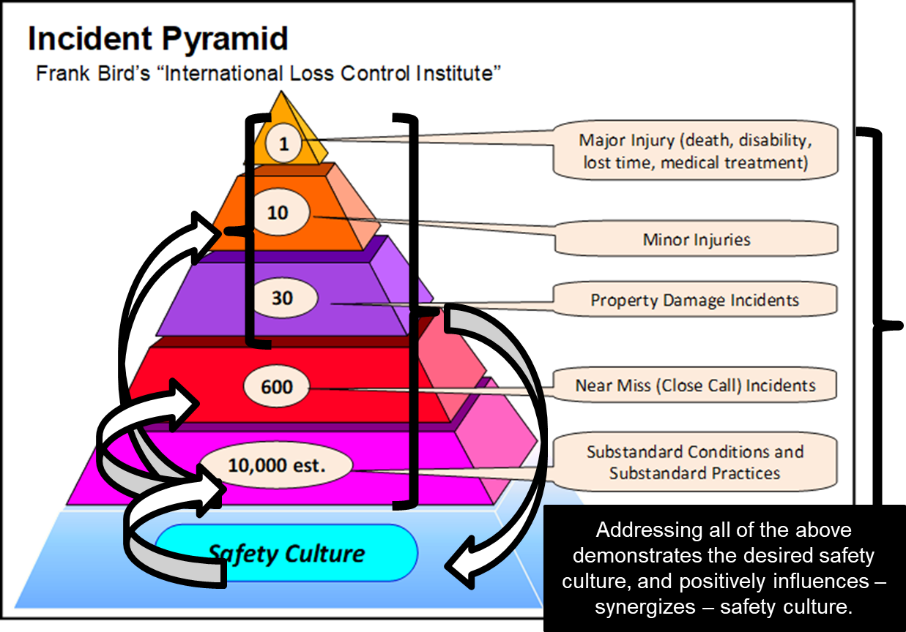

Above the line: 
  - PEAP affected
  - Loss incident
  - Reactive
Below the line: 
  - Near miss
  - substandard conditions
  - proactive

Reactive

--- 
- Major injuries
- Minor injuries
- Property damage
--- 
- Near miss
- Substandard conditions/practices
- Safety culture
---
Proactive


SAFETY CUlTURE IS AT THE BASE OF THE PYRAMID

3 tenants of risk management
- Incidents occur and are regularly reported in media
- Incidents are a tragedy, but the greater tragedy is to not learn from them
- All incidents are unacceptable and are preventable

Allocate resources to fix the stuff at the bottom first

## Cause and Effect Model

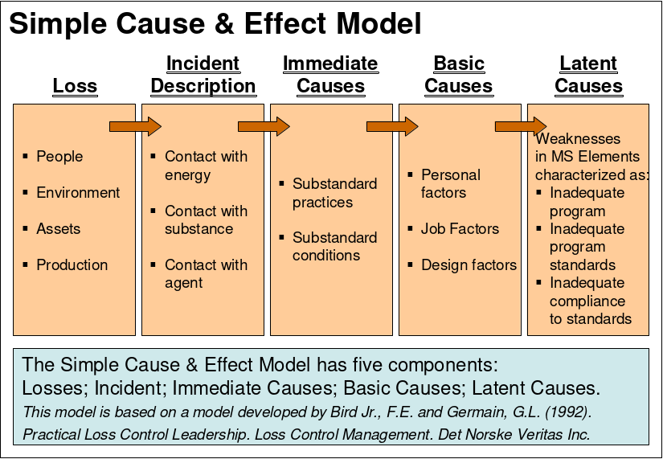


## RCA
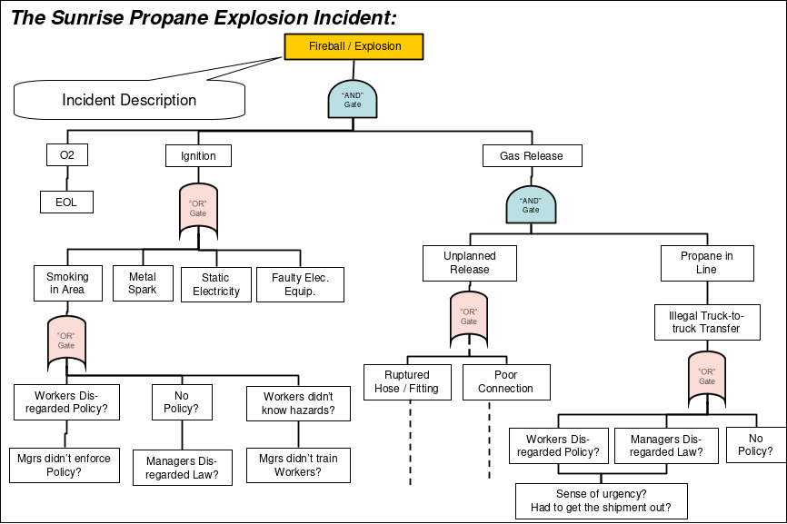
Keep asking why


## Swiss Cheese Model

1) Risk Management System Elements (RME)
2) Engineering Controls
3) Admin Controls
3) Work Controls

(Risk management work process is not part of the slices)

Each slice is a control. Problem when holes line up

## Effort vs. Gain
TODO

## Risk Reduction
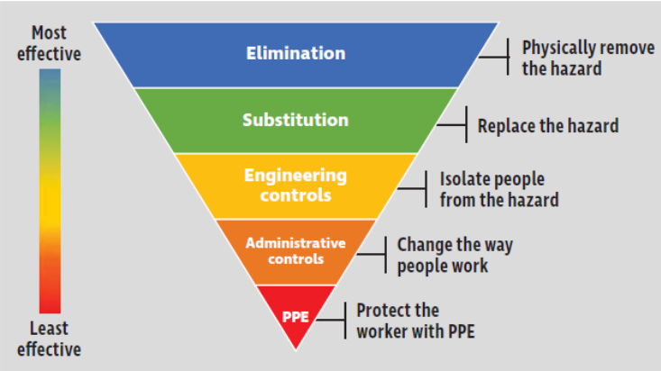

## Plan Do Check Act
It's a cycle 

Driven by RME 1: Management, Leadership and Accountability

- Plan: List the defects, determine which occur most often, target most commonly occurring for assessment and correction, determine % improvement required and time period
- Do: Adjust production parameters (temperature, speed, etc) for different product models, track results
- Check: Analyze results
- Act: Present results to management, standardize changes resulting in significant improvements

- Bias for action
  - Something happens in the news, similar to your company's operations
  - As a leader in your company, you should see if you're vulnerable in the
    same ways, through an audit
  - The best managers have a bias for action on all steps!

## Management of change
- Communicate the proposed change
- Conduct appropriate reviews and risk assessments
- Seek final approval
- Communicate and implement the change

## Millgram Experiments

(tl;dr People instructed to "torture" a person using a button. They heard
screams and felt terrible, but still obeyed authority. The screams were fake
)

**Position of authority leads to obedience to authority**

### 3 Key relationships
- You and your supervisor (position of authority)
- You and the people that work for you (position of authority)
- You and your peers.

- A supervisor carries an incredible amount of influence, something that must be used very responsibly.

### Auditing
- Were proposed changes communicated?
- What kinds of risk assessments were conducted for the scope of change? Appropriate? The right mix of stakeholders and SMEs? Did these result in revisions to the proposed change?
- Was final approval granted? What is the evidence that confirms the final approval checked that the MOC process was fully applied for the change?
- Was the change communicated prior to implementation? Were documents updated and training conducted prior to implementation? What evidence is there?

## Training Model
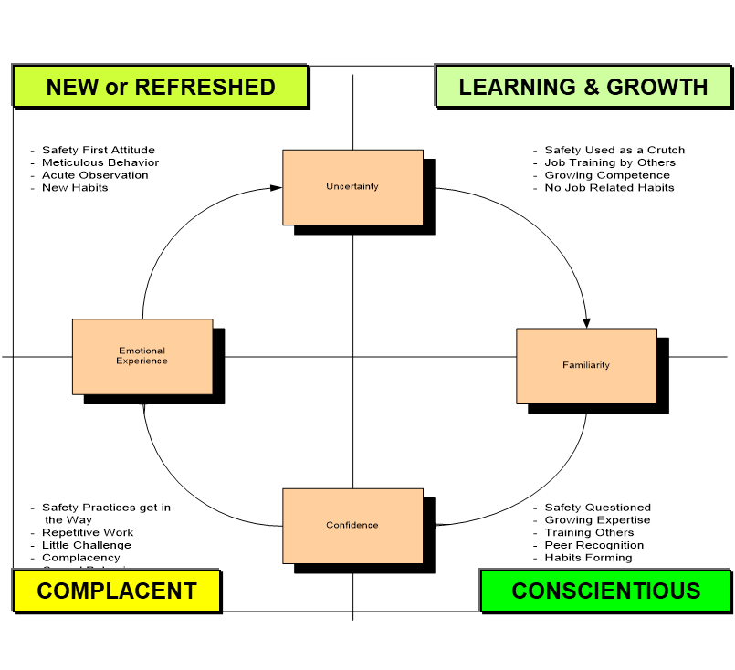
Bottom left covered up says habits formed

- Training reinforces desired behaviours


# Concepts
- Normalization of deviance (everyone else is doing it)
- Riding the risk envelope
- What is risk?
  Combination of concequences and likelihood of hazards being realized
  - What impact is possible
  - What can go wrong
  - How likely is it to occur
- Occupational safety generally refers to worker injuries, such as prevention of trips, slips and falls.
- Process safety includes the prevention of unintentional releases of chemicals, energy, or other hazardous materials
- Due diligence is the application of risk management:
    - Assess foreseeable risks
    - Implement reasonable precautions
    - Verify effectiveness (through records and documentation)
- Liability
    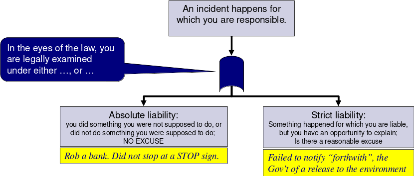
- Diamond incident characteristics
    - Unusual and non routine work (probably won't have SOP)
    - Sources of high energy present (like electric arc)
    - Contstruction
    - (sub_)contractors not as familiar with safety procedures
- Leaders make things happen (in a good way) that would not have happened otherwise.
    
  The best leaders encourage their employees to:
    - Contribute to a safe and successful workplace
    - Identify with the organization’s performance
    - Own the results achieved
    - Showcase their abilities and skills on a daily basis

  They do this by providing employees with intrinsic rewards:
    - Positive feedback
    - Technical support with resources
    - Emotional and cultural support
    - A positive work environment

Extrinsic rewards can backfire in terms of motivation, depending on the situation e.g. a bonus tied to fewer LTI’s, near misses 

- Leading and Lagging Indicators
    - Leading
        - Measured indirectly through the risk management program
        - good, RM program measured on an ongoing basis
    - Lagging
        - Measured after a lost incident
        - not ideal since it happens after the loss

Leaders can use leading indicators to:
  - Measure the overall effective implementation of a risk management program.
  - Influence the culture of an organization.
  - Identify weaknesses in RM programs especially relating to process safety, and use these to prioritize and allocate limited resources to address deficiencies in activities with high risk levels.

### Management model


ABC Model: 
- accidents
    - happens in the past -> behaviours
- consequences
    - consequences -> behaviours
- behaviours
    - behaviours -> outcomes

3 Dimensions

1) Positive or Negative
2) Immediate or Delayed
3) Certain or Uncertain

Only good combinations are 
- Positive, immediate, certain
- Negative, immediate, certain

## Upstream Downstream impacts

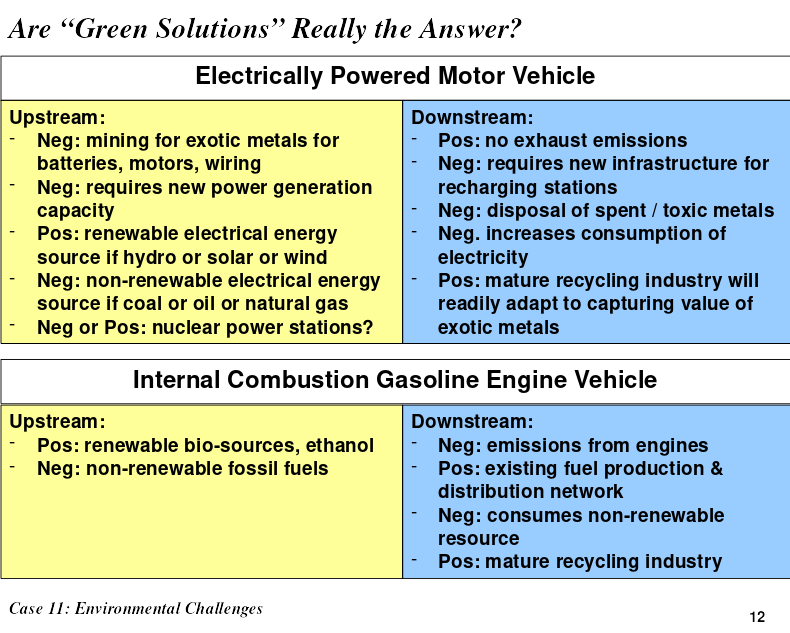

## WCB

- the tradeoff is that the worker cannot sue the company
  in exchange for benefits coverage

depending on track record
- employer discount up to 60%
- surcharge up to 240%

How claims are created
1) There needs to be an employer,
2) There needs to be a worker,
3) There needs to be an accident, and
4) There needs to be an injury

Compensation is based on 90% of previous earnings


# Formulae

## Injury Frequency Rate (IFR)

```
(num injuries) * 200 000 hours
--------------------------------
(total exposure hours)
```


## Sunrise Propane Explosion

what was going on?
- Illegal truck to truck transfer instead of truck to tank to truck
- The transfer hose failed
- Propane vaporized, gas cloud formed, exploded
- Large fire

Losses
- 2 workers killed
- homes and offices damaged
- evacuation 1.6km radius
- class action suit and litigation

Survival guide: 3) Put safety ahead of any other objective

RCA:

 Explosion (fuel, oxygen, ignition)

 Fuel:
  - leaking hose
  - used improperly or not maintained
  - someone wanted to do a shortcut
  - weak work culture
 Oxygen:
  - Cannot control
 Ignition:
  - static, truck engine, cigarette
  - stressed worker
  - no mechanisms to deal with worker stress, poor culture


what happened?
> Explosion (fuel, oxygen, ignition)

## Fernie Memorial Arena Ammonia Leak
important to prevent ammonia and brine from mixing

activity: refrigeration process to produce ice for rink
hazard: ammonia in piping (highly toxic, reactive, corrosive)
consequence: corrosion of pipes 

People: leak of toxic material
Environment:
Assets: rinks unusable for some time
Production: disruption to schedule of events

Occupational safety:
  Failure to wear PPE (respiratory protection)
  Lack of Safeguard model
Process Safety:
  Unable to contain because corrosion was not detected
  Trigger model

## Piper Alpha Offshore Oil Rig

Without sound leadership, the control of risks breaks down and unacceptable
events will happen

As leaders, we can prevent loss incidents, stop impacts on PEAP – prevent fatalities, injuries, pain and suffering

If we fail to hold the safety of the public and workers as paramount, we become responsible for the resulting pain and suffering from these incidents.

Day shift maintenance took away a pressure valve, replaced it with a thin
sheet of metal (substandard)

Misplaced permit to work

Pressure build -> vapour cloud -> explosion

### Situation
- pump a pressure relief valve replaced with temporary metal plate
- handover meeting between day and night staff did not discuss permit to work
for pump A
- the day engineer signed off the PTW for pump A
- both the night engineer and supervisor decided to put pump A back online

### Issue
- The night engineer and supervisor were rushing to put pump A back online
- the day engineer did not communicate with the night engineer that pump a was
  not safe to start
- the day engineer mismanaged the PTW associated with pump A

### Actions that should have been taken
- ensured the PTWs were properly managed and reviewd
- confirmed the integrity of pump A and piping system
- ensured the day ad night engineers met during shift change

- Key point #4
  - Piper alpha management did not recognize the misfiling and loss of PTW as a risk to the operation and did nothing to rectify the issue

- Key point #3 
  - the night engineer focused solely on maintaining productivity and preventing
    a rig shutdown

Had these actions been taken
- there would not be a gas release
- there would not be an explosion and fire
- the rig would not have been destroyed
- the incident would not have happened


## Fairchild (Cocky plane pilot)

Excellent pilor but did risky maneuvers

Immediate causes:
  - Banked plane too hard
  - Did not follow operating procedures
  - Plane was not designed to handle the bank angle

Basic Causes:
  - Senior staff did not enforce rules
  - Poor communication (senior staff turnover + verbal reprimands not written)
  - Junior staff did not report, saw nothing was being done

Corporate culture:
  Senior officers let it slide because it was good press

## Bhopal (Union Carbide)


Gas vapour cloud moved towards nearby population. Heavier than air, sleeping
city died. 

### Key lesson
  Must maintain a relentless focus on safety

### Organizational factors: 
  Slump in staff, high turnover of managers to less experienced managers

### Immediate cause
  Water mixed with Methyl Isocyanate (MIC).

### Basic Causes:
  - Tank integrity (release)
  - mitigation (preventing release) inaquedate engineering controls
  - enroachment (exposure)

### Latent causes:
- #3 Community awareness and emergency preparedness
    - People shouldn't be living there in the first place
    - City not prepared or emergency, hospital could not keep up
- #10 Employee competency and training
    - countermeasures shutdown
    - not trained well
    - not aware of importance of safety systems
- #2 risk assessment and management of risks
    - they did not understand the risks
- #4 management of change
    - 8 managers in 15 years
    - not aware of safe operating procedues, countermeasures shut off

### What would you do to fix it?
- hire a team of auditing experts
  - do it regularly, internal and 3rd party
  - procedures if audit is failed
- request reports measuring safety performance
    - number of incidents
    - near misses
    - substandard conditions
    - these are lagging indicators 
- send people to retain remote managers

regulation is the minimum standard to meet

## Exxon Valdez 

- Incident Reporting, Investigation, Analysis, and Action
- Management of Change

- Using the case study analysis, this loss incident demonstrates that it is vital to combat complacency in incident investigation and in management of change (ultimately in emergency preparedness) to prevent loss incidents. 

- Weakness in one of the above RME causes a weakness in the other

## Lac Megantic Train

Black smoke, brakes

Railway rules require hand brakes alone to be able to hold the train in place.

This time, the air brakes were on, the engine was left running. It didn't move
.. until the air brakes slowly lost pressure.

The train also needed maintenance but the part was not available. Management
wanted operation to continue, so a cheap epoxy J-B weld was used, which was
inadequate, and not according to manufacturer specification. 

Oil accumulated, black smoke from oil burning, and then fire.

The fire department put it out.
Standard operating procedre (SOP) required the firefighters talked with a train
person. This train person did not have experience.

And then runaway train


## BP Deepwater Horizon

Deep water horizon

### Key Lesson: It takes time to change culture.
Our management system will only be effective when it is developed, 
implemented, and maintained through active program evaluation and continuous improvement.

Gulf of mexico spill

P: 11 killed, 16 seriously injured

E: Inestimable impact

A: Tens of billions of dollars

P: Broad interruptions for US Gulf of Mexico offshore drilling industry; and Significant regulator intervention with regulatory impact

- Prolonged and extensive media coverage (reputational impact)

## Priority
the priority was getting the well to completion to save time and money

minimal focus on process safety

- rushing to complete the drilling work
  (Over budget, behind schedule, focus on costs)
- Disregard for critical safety engineered systems for controlling down-hole
pressures, detection of leakage, and blow-out prevention

Techical causes:
- mud density not correctly formulated
- penetration rate too quick
- too few cement plugs
- unsufficient time for cement to cure
- anomalies in down-hole pressure test and the blow-out preventer was not
properly diagnosed and corrected
- several components in BOP in a failure state like o-rings, back up battery

### Causes
- Rush to “get the job done”: 
    - Drilling rate faster than specified for formation
    - Premature removal of mud before cement plugs were completed

- BOP operation was deficient:
    - Damaged Annular on the Blowout Preventer (BOP) 
    - Inoperative Control Pods on the BOP
    - Damaged hydraulic line and weak battery on the BOP

- Incorrect interpretation of well data (inadequate standards/SOPs):
    - Process signals of a “kick” ignored (the lead-up prior to a blow-out)  
    - Pressure test to failed to confirm mud and plug integrity (pressure should have remained static/less mud returned to surface)

### Organizational Factors
- Incident happened after drilling & cement job completed
    - We tend let our guard down at the end of tasks 
- Transocean had a similar rig incident which demonstrated the need for well monitoring (lower consequences) in the UK just four months prior, but no transfer of lessons to Gulf of Mexico 
- The major hazards of drilling associated with process safety (containment of hydrocarbons under pressure) lacked management oversight compared to occupational safety
- BP experienced a significant process safety-related loss at their Texas City refinery in 2005 but a risk paradigm shift to focus more on process safety was lacking in the BP drilling organization in 2010


### RME

1) management leadership, commitment, accountability
  - rushed to complete drilling
  - disregard for safety systems, blowout prevention

2) risk assessment and management of risk
  - no effective safeguards
  - not constructed
  - not tested
  - not maintained
  - or removed

4) Management of change
  - a decision was made in spite of knowing deficiencies in the blowout prevention
  - should have stopped

6) Program evaluation and continuous improvement
  - they had good policies but did not effectively implement them


### Framework

#### What was the incident
BP-DWH offshore drilling rig, Gulf of Mexico off the coast of Louisiana.

#### What key point
#3 put safety ahead of any other objective

#### What is the situation
This is the description of the activity that covers the first of three points, specifically the specific aspect of the activity / facility / operation being examined
- The drilling deck and downhole operation where the well is being cemented and completed.

This is the description of the activity that covers the second of three points, specifically, the hazards / risks posed by the activity / facility / operation:
- Downhole pressure is controlled by mud density and by the cement plugs at completion. If the downhole pressure exceeds mud density or cement plugs, then an uncontrolled "kick” or blowout can happen i.e. gas and oil blow-out onto the drilling deck and rig, and pose a fire risk

This is the description of the activity that covers the third of three points, specifically, the potential deficiencies in the control measures of the activity / facility / operation:
- Improper mud density control or inferior completion / hardening of the cement plugs can lead to an inability to contain high down-hole pressures. If this situation becomes uncontrolled, the well could blow-out. The blow-out preventer (BOP) is the last line of defense for stopping a blow-out

#### Issue
The issue was that management made the decision to proceed with completion of the well (retract the downhole drilling tools and cement the well), despite known deficiencies including: the mud density, the less than the recommended number of cement plugs, and the less than the recommended cure time for the cement plugs. In other words, management rushed to complete the well, a major project milestone, and move on to the next stage of the project even though certain control measures were not as effectively implemented as they could be. This violated "Put safety ahead of any other objective”

#### What should have been done
The mud density should have been increased to contain the pressure. More cement plugs should have been installed to complete the well (contain the pressure). More time should have been allowed to cure (harden) the cement plugs and complete the well. Any / all three of these actions would decrease the likelihood of an uncontrolled kick and blow-out. These actions demonstrate "put safety ahead of any other objective”.

#### Probable outcome had the actions been followed
With the control measures (working BOP, correct number of cement plugs with proper cure time) in place, there would not have been an uncontrolled blowout, no explosion, and no fire. The loss incident would have been prevented, and there would not have been any impacts on PEAP - no fatalities, no release of immense quantities of crude oil to the Gulf of Mexico, no loss of production, and the rig would not have burned down and sank.


## Nypro Works Flixborough

1) Know Your Limitations
  - the chemical engineer should have recognized
    - not to design the piping spool to bypass the reactor
    - not to use scaffolding for support
    - not use an expansion joint
  - should have:
    - thorough mechanical analysis
    - competent mechanical engineer
2) Ask for Help
  - the chemical engineer should have asked for help
  - from the supervisor or manager
  - after being asked to do it
  - before proceeding with the changes

- Entire plant levelled.
- 28 deaths
- 36 serious injuries
- Hundreds of minor injuries
- 1,821 houses and 167 shops and 
- factories damaged.
- Fire burned for 10 days.


- the government did a public inquiry

Cycohexane Processing Plant

- Reactor 5 had a crack. 
- They bypassed it but the chemical engineer was not
qualified.  (dogleg_)
- There was no mechanical engineer on site
- chemical engineer thought it was expected of him
- manufacturer specifications not followed

### Situation
- The #5 Reactor has a crack on it.
- A replacement vessel or repairs on #5 would require a long production outage. 
- it was decided to bypass #5 in order to maintain production.

### Issue
Although it is not a bad thing to bypass a reactor, the concern was with how it was done. 

- A Chemical Engineer with only a little experience in industry designed the bypass consisting of the dog-leg piping, the bellows (expansion joint), and the piping support structure.
- He thought he knew enough to do it.
- He thought management expected it of him.
- He did not realize his professional responsibilities.
- No qualified mechanical engineer on site.
- Connection between reactors 4 and 6 considered a “routine plumbing job”.
- Bellows not designed for thrust.
- Manufacturer’s specifications: 
 “Bellows must be aligned unless pipe adequately supported.”
- Design standards for bellows ignored.
- Inadequate vertical and external support.
- Inadequate concern with failure cause of reactors.
- Inadequate concern with incidents at other locations with similar technologies. 
- Was there a “hurry up” attitude?

### Basic Causes
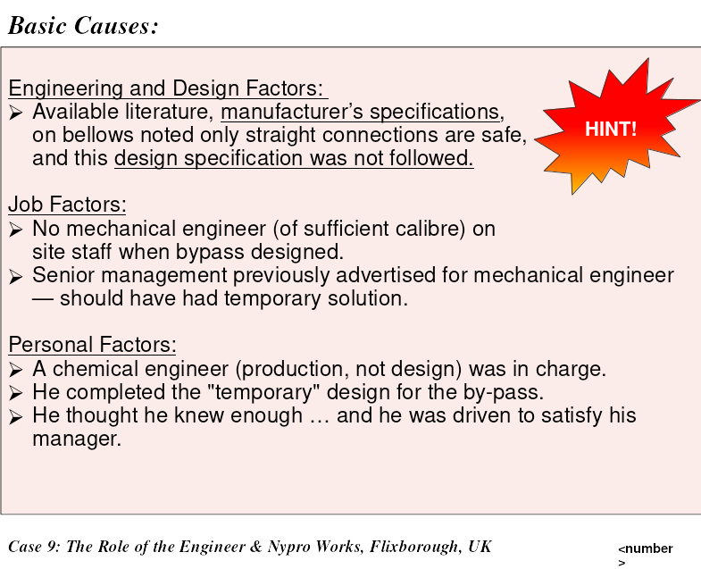

### Latent Causes, RME
- No one recognized the hazard of installing an inadequately designed piping spool. The risk assessment program for evaluating novel piping spools was inadequate. 2) RAMR

- The design process for piping spools allowed deviations beyond manufacturer’s specifications. 7) DC&SU

- There was no formal review process to examine, analyse, and assess (evaluate) the change in the piping system before it was being implemented. The MOC Program for managing changes on piping systems was inadequate. 4) MOC

## ALCOA Success Story
Aluminum company of America

- go beyond "what gets measured, gets managed"
- change starts at the top

if you have to choose between
- “When performance is measured, 
performance improves. 

- When performance is measured and 
reported back, the rate of improvement 
accelerates.”

Pick the second one ^^

## Hub Oil
Safety not a value

remember the lawyer guest speaker?
